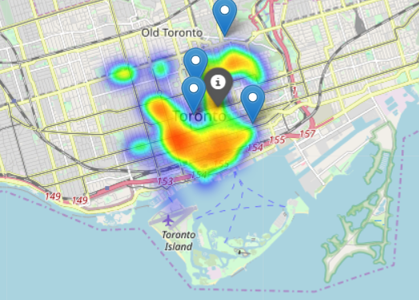
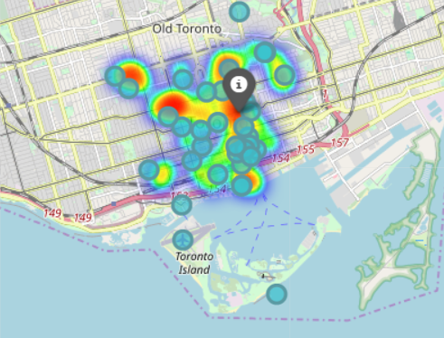

# Coursera Capstone

This is a Capstone Project Notebook (Coursera) for In this specialization learners developed and honed skills for practical data science and machine learning problems. The specialization included learning Python, as well as performing data analysis, and creating data visualizations using Python. Learners also completed a Capstone project to apply and demonstrate their newly acquired knowledge and skills.

Segmenting and Clustering Neighborhoods in Toronto
==========
In this assignment, you will be required to explore, segment, and cluster the neighborhoods in the city of Toronto. However, unlike New York, the neighborhood data is not readily available on the internet. What is interesting about the field of data science is that each project can be challenging in its unique way, so you need to learn to be agile and refine the skill to learn new libraries and tools quickly depending on the project.

For the Toronto neighborhood data, a Wikipedia page exists that has all the information we need to explore and cluster the neighborhoods in Toronto. You will be required to scrape the Wikipedia page and wrangle the data, clean it, and then read it into a pandas dataframe so that it is in a structured format like the New York dataset.

Once the data is in a structured format, you can replicate the analysis that we did to the New York City dataset to explore and cluster the neighborhoods in the city of Toronto.

Capstone Project - The Battle of Neighborhoods (Week 1)
--------------------
Define a problem or an idea of your choice, where you would need to leverage the Foursquare location data to solve or execute. Remember that data science problems always target an audience and are meant to help a group of stakeholders solve a problem, so make sure that you explicitly describe your audience and why they would care about your problem.

Describe the data that you will be using to solve the problem or execute your idea. Remember that you will need to use the Foursquare location data to solve the problem or execute your idea. You can absolutely use other datasets in combination with the Foursquare location data. So make sure that you provide adequate explanation and discussion, with examples, of the data that you will be using, even if it is only Foursquare location data.

Capstone Project - The Battle of Neighborhoods (Week 2)
--------------------
In this week, you will continue working on your capstone project. Please remember by the end of this week, you will need to submit the following:

A full report consisting of all of the following components:
Introduction where you discuss the business problem and who would be interested in this project.
Data where you describe the data that will be used to solve the problem and the source of the data.
Methodology section which represents the main component of the report where you discuss and describe any exploratory data analysis that you did, any inferential statistical testing that you performed, if any, and what machine learnings were used and why.
Results section where you discuss the results.
Discussion section where you discuss any observations you noted and any recommendations you can make based on the results.
Conclusion section where you conclude the report.
2. A link to your Notebook on your Github repository pushed showing your code.

3. Your choice of a presentation or blogpost. 

  

